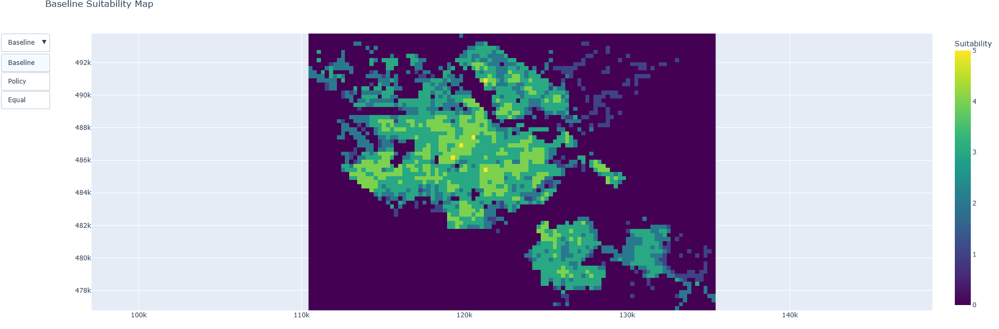

# Bachelor-Thesis
GIS-MCDA for Micro-Hub Location Analysis in Amsterdam

This repository contains the Python scripts used in the bachelor thesis:

**“GIS-MCDA for Micro-Hub Locations in Amsterdam”**

The project applies a Geographic Information Systems-based Multi-Criteria Decision Analysis (GIS-MCDA) framework to evaluate spatial suitability for urban logistics micro-hub locations in Amsterdam using open geospatial data.

---

## Project Overview

The goal of this project is to model and analyse spatial suitability for last-mile delivery micro-hubs. The analysis integrates multiple spatial criteria, including:

- Accessibility to major road infrastructure
- Delivery demand density (Kernel Density Estimation)
- Population density (CBS neighbourhood data)
- Land-use suitability
- Spatial constraints (water and non-developable areas)

These layers are combined using a weighted overlay approach to produce continuous suitability surfaces for different policy scenarios.

---

## Main Workflow

### 1. Data Preprocessing
- Load CBS Wijken en Buurten dataset
- Extract Amsterdam municipal boundary
- Clip road and spatial datasets to study area
- Ensure consistent coordinate reference system (EPSG:28992)

### 2. Suitability Modelling
- Raster-based weighted overlay analysis
- Scenario comparison:
  - Baseline weights
  - Policy scenario
  - Equal weights scenario

### 3. Validation
- Extraction of raster values at:
  - Existing micro-hub locations
  - Randomly generated reference points
- Statistical comparison using Mann–Whitney U test

---

## Repository Structure

### `raster_array.py`
Core analytical script used in the thesis.

Functions:
- Processes geospatial input layers
- Standardises criteria
- Applies weighted overlay analysis
- Generates suitability rasters
- Produces descriptive statistics
- Conducts validation analysis

This file represents the main GIS-MCDA methodology and ensures reproducibility of the results.

---

### `final_deliverable.py`
Final interactive dashboard and georeferenced visualization.

Functions:
- Loads generated suitability rasters
- Preserves GeoTIFF affine transformations
- Displays suitability maps in correct geographic orientation
- Compares policy scenarios using dropdown menus
- Produces histograms and validation plots

This file serves as the final presentation and decision-support interface.

---

### `microhub_planner.py`
Interactive scenario-testing tool.

Functions:
- Allows users to modify MCDA weights
- Generates custom suitability maps
- Supports rapid sensitivity analysis
- Enables stakeholder-driven experimentation

This file extends the thesis into a practical planning application.

---

## Key Outputs

The scripts generate:

- Weighted suitability rasters (baseline, policy, equal)
- Descriptive raster statistics (mean, std, min, max)
- Class distribution of suitability values
- Validation results comparing hubs vs random points


---

## Technologies Used

- Python 3.10+
- GeoPandas
- Rasterio
- NumPy
- SciPy
- Shapely

---

## Coordinate Reference System

All spatial data are projected to:

**EPSG:28992 — Amersfoort / RD New (Netherlands national coordinate system)**

---

## Installation

Install required dependencies using:

```bash
pip install geopandas rasterio numpy scipy shapely
```

